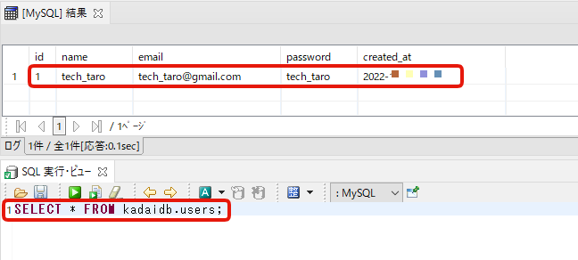

# Lesson8 JDBC1 追加課題

## JDBCを使って、コンソールから入力された値をデータベースに登録する課題


Webサイトで良く見られる会員登録機能を模したコンソールアプリを作成してみます。

動的なSQLを作成する方法を用いて、入力された値をデータベースに保存することを考えます。

入力する値は、**名前** 、**メールアドレス** 、**パスワード** の3つとします。

まずは、MySQLのkadaidbデータベースの中に、コンソールから入力された値を保存する**users**テーブルを作成しましょう。

DBViewerで以下のSQLを実行してusersテーブルを作成してください。

```sql
create table kadaidb.users(
	id int primary key auto_increment,
	name varchar(255) not null,
	email varchar(255) not null unique,
	password varchar(255) not null,
	created_at timestamp DEFAULT CURRENT_TIMESTAMP ON UPDATE CURRENT_TIMESTAMP
);
```

### 流れ

プログラムを実行すると、以下の流れで進行します。

1. コンソールで名前を入力してエンターキーを押します。
2. コンソールでメールアドレスを入力してエンターキーを押します。
3. コンソールでパスワードを入力してエンターキーを押します。
4. kadaidbデータベースの中の usersテーブルに入力された情報が挿入されます。


### 仕様

作成するクラス名は **Review06Advance** とします。

Review06Advanceクラスは、mainメソッドと コンソール入力を担当するkeyInメソッドの2つのメソッドを持つとします。

keyInメソッドの中身は今までと同様に以下としてください。

```java。
	/*
	 * キーボードから入力された値をStringで返す 引数：なし 戻り値：入力された文字列
	 */
	private static String keyIn() {
		String line = null;
		try {
			BufferedReader key = new BufferedReader(new InputStreamReader(System.in));
			line = key.readLine();
		} catch (IOException e) {

		}
		return line;
	}
```

以下の実行結果例と同じ表示結果になるようにmainメソッドの内部を実装します。

```bash
名前を入力してください > tech_taro
メールアドレスを入力してください > tech_taro@gmail.com
パスワードを入力してください > tech_taro
tech_taroさんの会員登録が完了しました
```

またこの時、DBViewerで以下のSQLを実行すると

```
SELECT * FROM kadaidb.users;
```

以下の画像のように、実際に入力されたデータがusersテーブルに保存されるようにしてください。




### 更なる改良をしたい場合（必須ではありません）

現状では、入力する名前、メールアドレス、パスワードは、空入力の場合でもデータベースに保存されてしまいます。

しかしながら実務においては、入力された値が適切かどうかを判断し、適切である場合だけデータベースに値を保存する処理を実装します。

これを勘案して、入力された値が不適切の場合は再度入力を促してくる機能を実装してみるとさらに面白いでしょう。


例として以下の条件を課しています。
```
名前は空文字ではNG
メールアドレスは @ という文字を含んでいる
パスワードは5文字以上
```

この場合の実行例は以下のような感じとなります。
```bash
名前を入力してください > 
[入力エラー] 名前を正しく入力してください
名前を入力してください > tech_hanako
メールアドレスを入力してください > 
[入力エラー] メールアドレスを正しく入力してください
メールアドレスを入力してください > aaa
[入力エラー] メールアドレスを正しく入力してください
メールアドレスを入力してください > tech_hanako@gmail.com
5文字以上のパスワードを入力してください > hana
[入力エラー] パスワードは5文字以上を入力してください
5文字以上のパスワードを入力してください > hanako
tech_hanakoさんの会員登録が完了しました
```


## 解答例

```java
import java.io.BufferedReader;
import java.io.IOException;
import java.io.InputStreamReader;
import java.sql.Connection;
import java.sql.DriverManager;
import java.sql.PreparedStatement;
import java.sql.ResultSet;
import java.sql.SQLException;

public class Review06Advance {

	public static void main(String[] args) {

		// データベース接続と結果取得のための変数
		Connection con = null;
		PreparedStatement pstmt = null;
		ResultSet rs = null;
		try {

			Class.forName("com.mysql.cj.jdbc.Driver");

			con = DriverManager.getConnection(
					"jdbc:mysql://localhost/kadaidb?useSSL=false&allowPublicKeyRetrieval=true",
					"root", "パスワード");

			String sql = "INSERT INTO users(name, email, password) VALUES(?, ?, ?)";

			pstmt = con.prepareStatement(sql);

			System.out.print("名前を入力してください > ");
			String name = keyIn();

			System.out.print("メールアドレスを入力してください > ");
			String email = keyIn();

			System.out.print("パスワードを入力してください > ");
			String password = keyIn();

			pstmt.setString(1, name);
			pstmt.setString(2, email);
			pstmt.setString(3, password);

			int count = pstmt.executeUpdate();
			System.out.println(name + "さんの会員登録が完了しました");

		} catch (ClassNotFoundException e) {
			System.err.println("JDBCドライバのロードに失敗しました。");
			e.printStackTrace();
		} catch (SQLException e) {
			System.err.println("データベースに異常が発生しました。");
			e.printStackTrace();
		} finally {
			// 7. 接続を閉じる
			if (rs != null) {
				try {
					rs.close();
				} catch (SQLException e) {
					System.err.println("ResultSetを閉じるときにエラーが発生しました。");
					e.printStackTrace();
				}
			}
			if (pstmt != null) {
				try {
					pstmt.close();
				} catch (SQLException e) {
					System.err.println("Statementを閉じるときにエラーが発生しました。");
					e.printStackTrace();
				}
			}
		}
		if (con != null) {
			try {
				con.close();
			} catch (SQLException e) {
				System.err.println("データベース切断時にエラーが発生しました。");
				e.printStackTrace();
			}
		}

	}

	/*
	 * キーボードから入力された値をStringで返す 引数：なし 戻り値：入力された文字列
	 */
	private static String keyIn() {
		String line = null;
		try {
			BufferedReader key = new BufferedReader(new InputStreamReader(System.in));
			line = key.readLine();
		} catch (IOException e) {

		}
		return line;
	}

}

```

更なる改良をした解答例
```java
import java.io.BufferedReader;
import java.io.IOException;
import java.io.InputStreamReader;
import java.sql.Connection;
import java.sql.DriverManager;
import java.sql.PreparedStatement;
import java.sql.ResultSet;
import java.sql.SQLException;

public class Review06Advance {

	public static void main(String[] args) {

		// データベース接続と結果取得のための変数
		Connection con = null;
		PreparedStatement pstmt = null;
		ResultSet rs = null;
		try {

			Class.forName("com.mysql.cj.jdbc.Driver");

			con = DriverManager.getConnection(
				"jdbc:mysql://localhost/kadaidb?useSSL=false&allowPublicKeyRetrieval=true",
				"root", "パスワード");

			String sql = "INSERT INTO users(name, email, password) VALUES(?, ?, ?)";
			pstmt = con.prepareStatement(sql);

			String name = "";
			do {
				System.out.print("名前を入力してください > ");
				name = keyIn();
				if (!name.equals("")) {
					break;
				}
				System.out.println("[入力エラー] 名前を正しく入力してください");
			} while (true);

			// メールアドレス重複チェック
			String email = "";
			do {
				System.out.print("メールアドレスを入力してください > ");
				email = keyIn();

				if (email.contains("@")) {
					break;
				}
				System.out.println("[入力エラー] メールアドレスを正しく入力してください");
			} while (true);

			String password = "";
			do {
				System.out.print("5文字以上のパスワードを入力してください > ");
				password = keyIn();
				if (password.length() >= 5) {
					break;
				}
				System.out.println("[入力エラー] パスワードは5文字以上を入力してください");
			} while (true);

			pstmt.setString(1, name);
			pstmt.setString(2, email);
			pstmt.setString(3, password);

			int count = pstmt.executeUpdate();
			System.out.println(name + "さんの会員登録が完了しました");

		} catch (ClassNotFoundException e) {
			System.err.println("JDBCドライバのロードに失敗しました。");
			e.printStackTrace();
		} catch (SQLException e) {
			System.err.println("データベースに異常が発生しました。");
			e.printStackTrace();
		} finally {
			// 7. 接続を閉じる
			if (rs != null) {
				try {
					rs.close();
				} catch (SQLException e) {
					System.err.println("ResultSetを閉じるときにエラーが発生しました。");
					e.printStackTrace();
				}
			}
			if (pstmt != null) {
				try {
					pstmt.close();
				} catch (SQLException e) {
					System.err.println("Statementを閉じるときにエラーが発生しました。");
					e.printStackTrace();
				}
			}
		}
		if (con != null) {
			try {
				con.close();
			} catch (SQLException e) {
				System.err.println("データベース切断時にエラーが発生しました。");
				e.printStackTrace();
			}
		}

	}

	/*
	 * キーボードから入力された値をStringで返す 引数：なし 戻り値：入力された文字列
	 */
	private static String keyIn() {
		String line = null;
		try {
			BufferedReader key = new BufferedReader(new InputStreamReader(System.in));
			line = key.readLine();
		} catch (IOException e) {

		}
		return line;
	}

}

```
